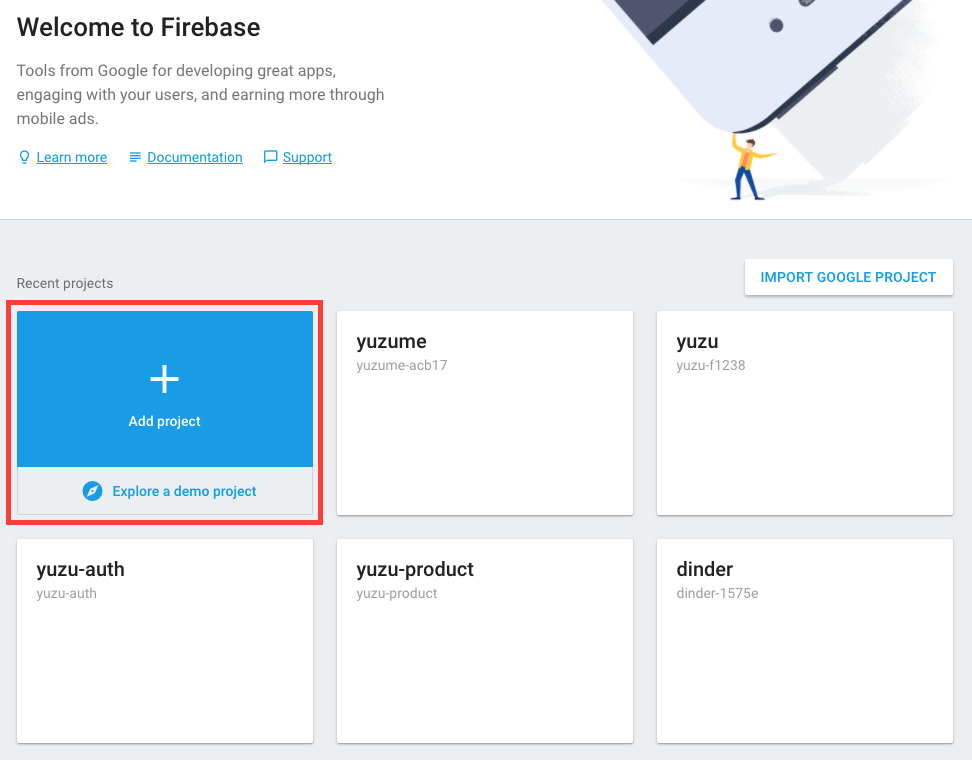
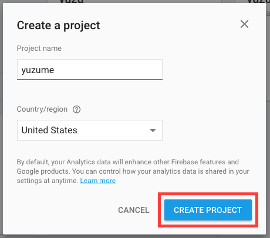
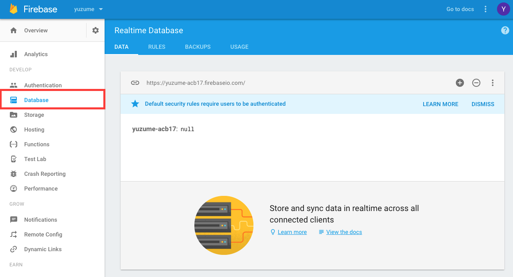
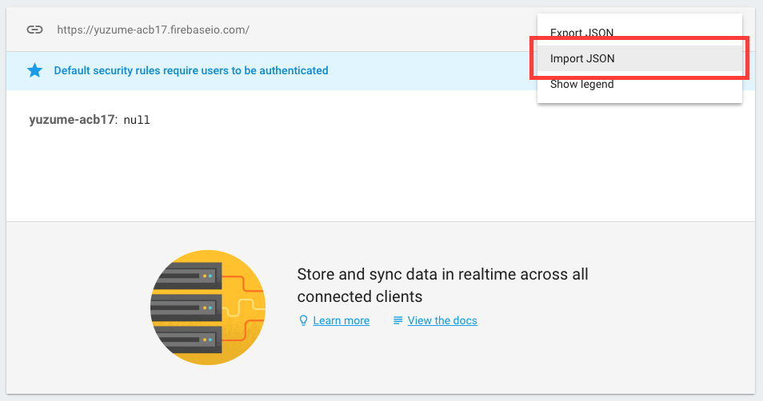
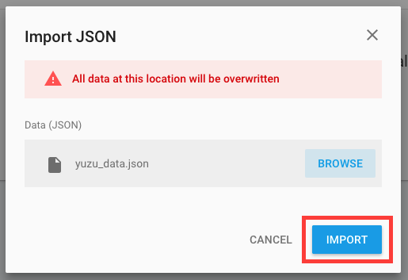
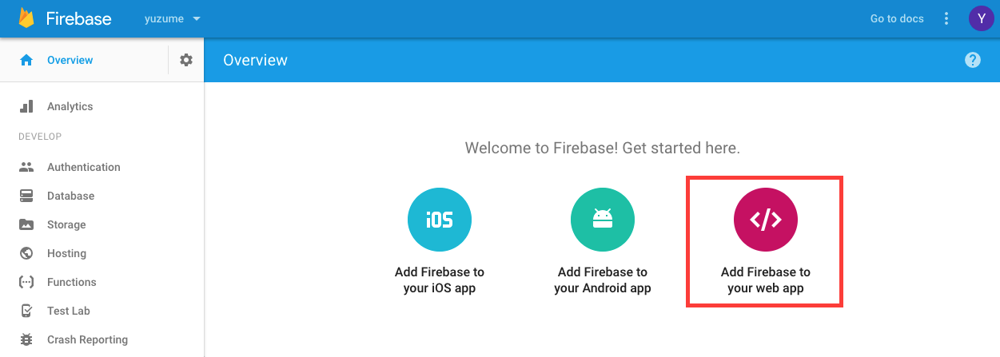
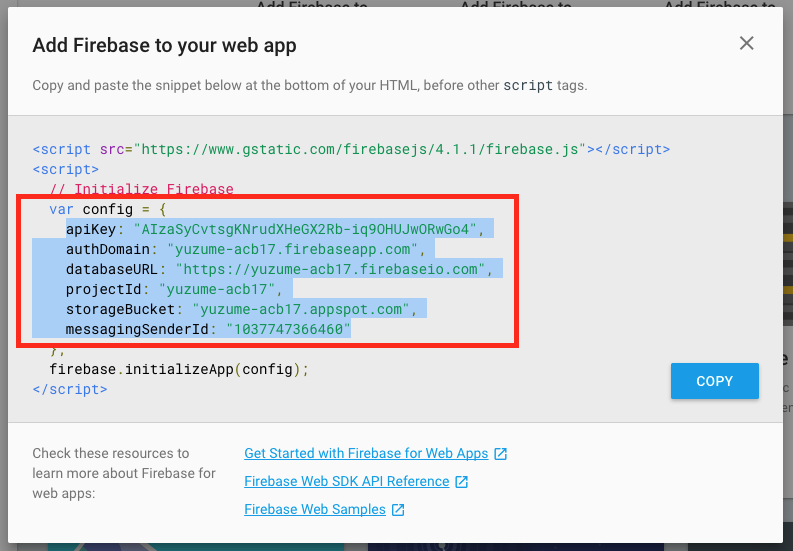
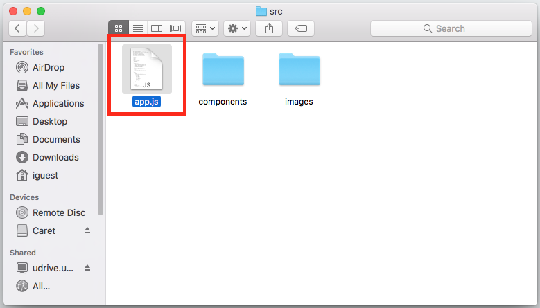
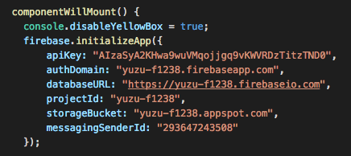
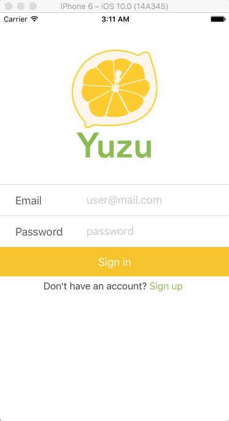

# Getting Started with the Yuzu App

### 1. Install Homebrew
	/usr/bin/ruby -e "$(curl -fsSL https://raw.githubusercontent.com/Homebrew/install/master/install)"
Source: [Homebrew](https://brew.sh/)

### 2. Install Dependencies
	brew install node
	brew install watchman
	
### 3. Install the React Native CLI
	npm install -g react-native-cli
	
### 4. Install Xcode
Visit the Mac App Store: [Here](https://itunes.apple.com/us/app/xcode/id497799835?mt=12)

Source: [Facebook](https://facebook.github.io/react-native/docs/getting-started.html)

### 5. Clone the Repository
	https://github.com/lisally/yuzu.git
	
### 6. Install Node Packages
	npm install
	
### 7. Create a Firebase Account
Create a Free Account: [Here](https://firebase.google.com/)

### 8. Create a New Firebase Project

### 9. Download the Yuzu Data
Download Yuzu's Product and Location Data: [Here](https://github.com/lisally/yuzu/tree/master/documentation/yuzu_data.json)

### 10. Navigate to Your Project's Database and Import Data

### 11. Navigate Back to Overview Page For Web App Key

### 12. Copy the Highlighted Account Key

### 13. Open the Yuzu Repository and Navigate to App File
	yuzu > src > app.js

### 14. Paste Your Account Key to the Highlighted Section

### 15. Open up the Command Line and Navigate to the Yuzu Folder Location and Run the App
	react-native run-ios
	
