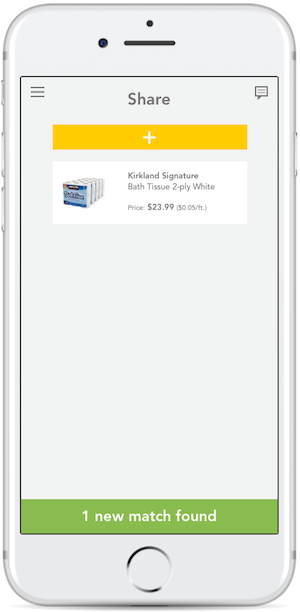

## Table of Contents

## Overview

Yuzu is a mobile application that targets to solve the pain points when buying in bulk. While wholesale stores offer great value when bulk shopping, it also contributes to the food waste crisis by the excessive quantity of bulk items left unfinished. Yuzu allows its users (Yuzu-ers) to find shoppers in real-time, at the same location, to split items with. Shoppers purchase items at bulk prices and reduced quantities by being matched with each other depending on the shared items of interest. This solution creates a social community where sharing is not only caring, but saving money and reducing waste.

### Problem
Wholesale stores provide quality items in affordable prices, but with items being sold in large quantities, they result in waste of goods and higher total bill, preventing people from saving money
### Research
Our team conducted user-research on 52 survey participants. 

* 90% of the survey respondents shop at wholesale stores due to lower cost per item. 
* 48%of the survey respondents do not shop at wholesale stores due to bulk quantities. 
* 40%of the survey respondents reported. disposing of goods purchased in bulk quantities

## Solution

## Clickable Prototype

## Mobile Application (Beta)

### Add
<kbd>

</kbd>

### Match
<kbd>

</kbd>

### Message
<kbd>

</kbd>

## Summary of the Major Technology Decisions
Programming Framework: React-Native

Database: Firebase

Authentication: Firebase

## Technology Stack and Rationale
### React Native
We decided to build our application using React-Native, a programming framework developed by Facebook to build native mobile applications. We chose this because it allows developers to deploy on both Android and iOS once written in JavaScript. Our team focused primarily on the iOS app, but due to the nature of React-Native, we were able to consider that Android portion is also "written" as soon as the iOS portion was completed.

### Firebase
We decided to use Firebase, a mobile and web application development platform built by Google. We use Firebase for their Authentication service because we are easily and quickly able to authenticate users using email/password combos. We also used Firebase's real-time Database service to store our Costco locations, product data, user data, as well as real-time matching data. Their real-time database has a easy-to-use user interface to access and modify to data directly in the browser. It also provided massive storage size potential and real-time data management, which was crucial for our mobile application.

## Promotion Video

## Awards
### UW iSchool 2017 Commercial Potential Award

## The Team
Yuzu: [Email](yuzu.me@outlook.com) | [Website](http://yu-zu.me/)

Derry Cheng : [Email](derryc09@uw.edu) | [LinkedIn](https://www.linkedin.com/in/derrycheng/)

Sally Li : [Email](lisally@uw.edu) | [LinkedIn](https://www.linkedin.com/in/lisally95/)

Jessica (Hyerin) Ro : [Email](jessro95@uw.edu) | [LinkedIn](https://www.linkedin.com/in/jessicahyerinro/)

Stacy (Yunpei) Zeng : [Email](stacyz@uw.edu) | [LinkedIn](https://www.linkedin.com/in/yunpeizeng/)